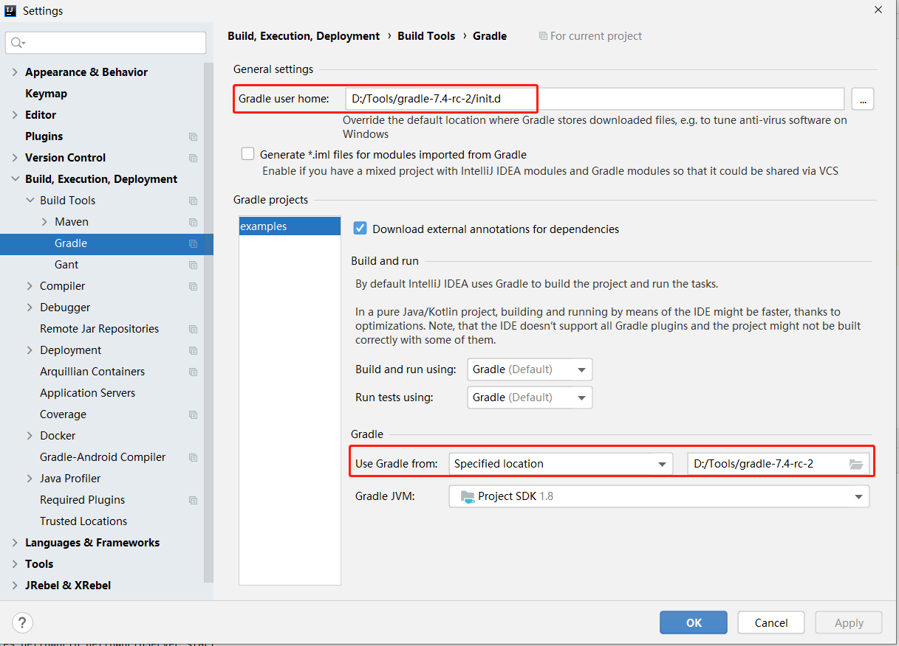

## proto-buff语法参考:  
https://protobuf.dev/reference/java/java-generated/


## grpc-demo-run
通过官网的demo，理解grpc的Server和Client
https://grpc.io/docs/languages/java/quickstart/  
建议使用使用提供的gradlew命令，遇到问题请参考[demo-run问题](#遇到的问题)  

## code解析
1. demo中的业务代码，其实就是sayHello的实现，在
`GreeterGrpc.GreeterImplBase`中
```
    @Override
    public void sayHello(HelloRequest req, StreamObserver<HelloReply> responseObserver) {
      HelloReply reply = HelloReply.newBuilder().setMessage("Hello " + req.getName()).build();
      responseObserver.onNext(reply);
      responseObserver.onCompleted();
    }
```

2. 服务端  
```
int port = 50051;
    server = ServerBuilder.forPort(port)
        .addService(new GreeterImpl())
        .build()
        .start();
```

3. 客户端
```
1) 通过地址创建channel
ManagedChannel channel = ManagedChannelBuilder.forTarget("localhost:50051")
        // 使用明文避免需要证书
        .usePlaintext().build();
2) 通过channel创建stub
HelloGrpc.HelloBlockingStub blockingStub = HelloGrpc.newBlockingStub(channel);
3) 创建request并设置参数
HelloRequest request = HelloRequest.newBuilder().setName(name).build();
4) 通过stub发送request
    HelloReply response response = blockingStub.sayHello(request);
```  

---

### 遇到的问题
1. 开始参考quick start跑demo的时候，maven提示找不到jar包，然后我果断切换到一个2021年的分支。但还是报找不到jar报, 在maven仓库中搜索了下确实找不到`grpc-stub 1.33.2-SNAPSHOT`,果断替换成`1.33.1`  
2. maven编译成功后，IDEA中始终会显示包没引用正确的报错标记。但其实这只是IDEA的显示问题，不影响run，前提是无法通过界面运行Client和Server的Main方法了。  
> 在IDEA显示问题上追究很浪费时间，别忘记要学习的内容   

这里需要一下mvn的知识:  
run server
```
mvn  -Dexec.mainClass=io.grpc.examples.helloworld.HelloWorldServer exec:java
```
run client
```
mvn  -Dexec.mainClass=io.grpc.examples.helloworld.HelloWorldClient exec:java
```
3. 本来还很奇怪grpc官网连jdk7都可以支持，怎么mvn编译demo的方式也不提供下。用过之后，只想说 **真香** --> [安装使用gradle](#安装使用gradle)  
4. 注意生成的代码在`target`或`build`目录
---

### 安装使用gradle  

#### 1. 理解
https://juejin.cn/post/6932813521344430094  


#### 2. 安装
从[安装目录](https://services.gradle.org/distributions/)找一个不那么早的下载，然后bin目录加入到path即可  
`gradle -v` 验证

#### 3.配置
3.1 镜像
在bin的上级目录新建文件 **init.gradle** 设置国内代理
```
allprojects {
    repositories {
        maven { url 'file://D:/maven_repo'}
        mavenLocal()
        maven { name "Alibaba" ; url "https://maven.aliyun.com/repository/public" }
        maven { name "Bstek" ; url "http://nexus.bsdn.org/content/groups/public/"}
        mavenCentral()
    }
    buildscript { 
        repositories { 
            maven { name "Alibaba" ; url 'https://maven.aliyun.com/repository/public'}
            maven { name "Bstek" ; url 'http://nexus.bsdn.org/content/groups/public/' }
            maven { name "M2" ; url 'https://plugins.gradle.org/m2/'}
        }
    }
}
```
**注意：** 这里有个指向本地目录是gradle本地仓库，其实也可以是maven本地仓库  

3.2 IDEA配置  
以下是IDEA的配置截图



## 其他demo参考
https://www.cnblogs.com/zhongyuanzhao000/p/13783165.html

